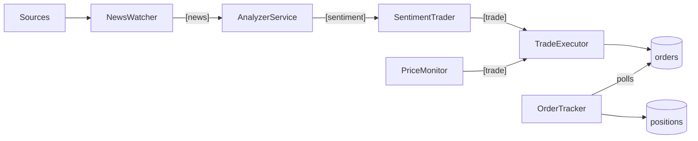

# EonTrading

News-driven trading system: data collection, backtesting, and live execution.

**Scope:** Cash only — no margin, no leverage, no short selling. Max loss = initial capital.

## How it works

```
[news] → [sentiment] → [trade]
```

Everything flows through event channels (LocalEventBus or RedisStreamBus). Fill confirmation is handled by OrderTracker (polls `orders` collection), not a channel.

## Quick Start

```bash
# 1. Python 3.11 + venv
pyenv install 3.11.13 && pyenv global 3.11.13
python3 -m venv .venv && source .venv/bin/activate

# 2. Configure
cp .env.example .env    # edit with your API keys
pip install -e .

# 3. Run
python run.py                # single process (default)
python run.py start          # distributed — all 7 components + log tailer
python run.py stop           # stop all
python run.py status         # check running processes
python run.py restart        # stop + start
```

## Architecture

**Databases:** MongoDB (all state) + Redis (message queue + price cache)

**Deployment:**
- **Single process** — all components in one process via LocalEventBus. Best for dev, replay, debugging.
- **Distributed** — each component in its own process via Redis Streams. Best for production, isolation, scaling.

Same component code, all modes. Components don't know which transport they're on.

## Live Pipeline



- SL/TP self-managed by PriceMonitor — same behavior in backtest and live
- OrderTracker is the sole handler of fill confirmation — polls `orders`, updates `positions` on fill
- TradeExecutor only submits trades to broker and writes to `orders` — never touches positions
- PositionStore is source of truth for holdings (qty, entry price) — broker consulted only at startup for reconciliation
- Graceful shutdown on SIGINT/SIGTERM

## Components

| Component | File | Role |
|-----------|------|------|
| **NewsWatcher** | `src/live/news_watcher.py` | Polls news sources (RSS, Reddit, NewsAPI, Finnhub, Twitter), publishes `[news]` events |
| **AnalyzerService** | `src/live/analyzer_service.py` | Subscribes `[news]`, runs sentiment analysis (keyword or LLM), publishes `[sentiment]` |
| **SentimentTrader** | `src/live/sentiment_trader.py` | Subscribes `[sentiment]`, decides buy/sell based on thresholds and position state, publishes `[trade]` |
| **PriceMonitor** | `src/live/price_monitor.py` | Polls prices for open positions, publishes `[trade]` on SL/TP hit |
| **TradeExecutor** | `src/live/brokers/broker.py` | Subscribes `[trade]`, submits orders to broker, writes to `orders` collection |
| **OrderTracker** | `src/common/order_tracker.py` | Polls pending orders in MongoDB, confirms fills with broker, updates `positions` on fill |
| **PositionStore** | `src/common/position_store.py` | MongoDB-backed position state — source of truth for holdings |

### NewsWatcher

Polls configured news sources every 120s. Deduplicates by URL using MongoDB `seen_urls` collection.

To re-fetch all articles from scratch (e.g. after changing sources or testing):

```bash
python scripts/clear_seen_urls.py
```

## Logs

Each component writes structured JSON to `logs/{component}.log`. Two ways to view:

```bash
python scripts/tail_logs.py          # open terminal per log file (tail -f)
# or
python scripts/logtail.py --port 8001  # web UI at http://localhost:8001
```

In distributed mode, the log tailer starts automatically on port 8001.

## Configuration

Copy `.env.example` to `.env`. All vars optional — default is PaperBroker + keyword analyzer, no keys needed.

| Mode | What to set |
|------|-------------|
| Dev (paper + keyword) | Nothing |
| LLM sentiment | `OPENAI_API_KEY` |
| Live broker | `BROKER=`, `ALPACA_API_KEY`, etc. |
| News sources | `NEWSAPI_KEY`, `FINNHUB_KEY`, etc. |

## Brokers

| Broker | Confirmation | Env |
|--------|-------------|-----|
| PaperBroker (default) | Instant (dry run) | — |
| Futu | Poll or callback | `BROKER=futu` + `futu-api` ([install guide](docs/futu-opend-install.md)) |
| IBKR | Callback | `BROKER=ibkr` + `ib_insync` |
| Alpaca | Poll | `BROKER=alpaca` + keys |

## Replay Mode

Same pipeline, historical data:

```bash
python -m src.live.replay --start 2025-01-01 --end 2025-06-01
```

## Testing

```bash
python -m pytest tests/ -q              # 269 tests
python -m pytest tests/ -q --cov=src    # with coverage
```

## API Endpoints

| Endpoint | Description |
|----------|-------------|
| `GET /api/health` | Status, open positions, heartbeats |
| `GET /api/reconcile` | Compare system vs broker |
| `GET /api/trades` | Trade history |
| `GET /api/news` | Recent articles |
| `GET /api/logs` | Recent logs from MongoDB |
| `GET /api/backtest` | Sentiment backtest (legacy) |
| `GET /api/price-backtest` | Price backtest (SMA/RSI) |
| `POST /api/live-backtest` | Start live pipeline backtest |
| `GET /api/live-backtest/{id}` | Poll backtest result |
| `GET/POST /api/docker/*` | Container management |

## Project Structure

```
src/
├── api/server.py              # FastAPI
├── backtest/                  # Engine, portfolio, sentiment
├── common/                    # Event bus, order_tracker, position_store, trading_logic, etc.
├── data/news/                 # NewsAPI, Finnhub, RSS, Reddit, Twitter
├── data/storage/              # ClickHouse
├── live/                      # Watcher, analyzer, trader, monitor, brokers, runners
└── strategies/                # Sentiment (keyword + LLM)
frontend/                      # React + Vite dashboard
scripts/                       # logtail.py, tail_logs.py, distributed.py, utils
tests/                         # 269 tests
```

## Data Stores

| Collection | Purpose | Writer | Reader(s) |
|---|---|---|---|
| `positions` | Current open positions (1 doc / symbol) with qty, entry price | OrderTracker (on fill) | SentimentTrader, PriceMonitor, Reconcile, API |
| `orders` | Full order lifecycle (pending → filled / failed / timeout) | TradeExecutor (submit), OrderTracker (update) | OrderTracker (poll) |
| `heartbeats` | Component health (updated every 30s) | All components | API |
| `logs` | Structured logs from all components | LogCollector | API, logtail |

**Design rule:** PositionStore is the canonical source for current holdings. Never infer positions from `orders` — always use `positions`.

## Deploy (VPS)

```bash
ssh user@your-vps
cd EonTrading
git pull
python run.py restart        # stop all, start all with new code
python run.py status         # verify all components are running
```

Logs are in `logs/` — each component writes to its own file.

## Sentiment Analyzers

| Analyzer | When |
|----------|------|
| `KeywordSentimentAnalyzer` | Free, fast, no deps |
| `LLMSentimentAnalyzer` | More accurate, needs key |

Supports OpenAI, Azure OpenAI, and local Ollama.

## Roadmap

**Done:** Live pipeline (3 channels: [news], [sentiment], [trade]), 5 news sources, 4 brokers, single `orders` collection for order lifecycle, OrderTracker state machine (fill/fail/timeout), MongoDB persistence, dedup, 2 analyzers (keyword + LLM), SL/TP (trailing), backtesting (sentiment + price), React dashboard, single/distributed modes, Redis Streams, replay mode, price cache, transaction costs, Docker Compose deployment, heartbeats, graceful shutdown, 269 tests.

**To do:** Cross-source dedup, inverse ETF support, sector trading, real-news backtest, side-by-side comparison, live dashboard, Telegram alerts.
